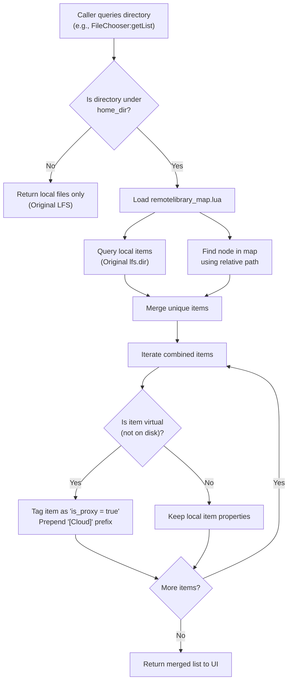
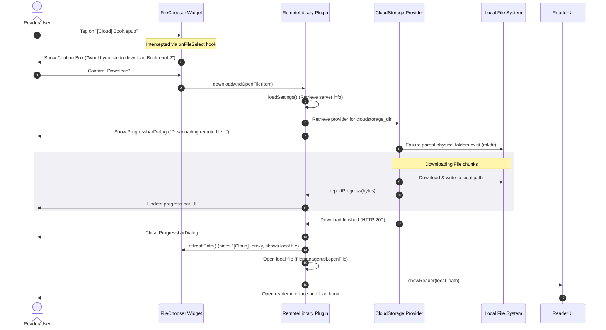

# RemoteLibrary Plugin Architecture

This document provides a developer-focused technical overview of the **RemoteLibrary** KOReader plugin. It explains how the plugin transparently overlays remote cloud library structures on top of the local filesystem and handles on-demand downloading of files.

---

## 🏗️ High-Level Overview

Unlike typical integrations that require rewriting file browsing and viewing interfaces, **RemoteLibrary** leverages Lua's dynamic nature. It intercepts filesystem and UI events at the lowest possible layer via **global monkey-patching** (metatable extensions and global function replacement).

By intercepting and modifying the output of KOReader's standard file system access library (`libs/libkoreader-lfs`), realpath resolver (`ffi/util`), metadata engines (`bookinfomanager`, `filemanagerbookinfo`), and reading entry points (`ReaderUI`), the rest of the application interacts with virtual files as if they were already present on disk.

```
┌──────────────────────────────────────────────────────────────────┐
│                           KOReader UI                            │
│    (FileChooser, ReaderUI, BookInfoManager, Bookshelf, etc.)     │
└────────────────────────────────┬─────────────────────────────────┘
                                 │ Intercepts events / API calls
                                 ▼
┌──────────────────────────────────────────────────────────────────┐
│                   RemoteLibrary Patches / Hooks                  │
│                                                                  │
│  - ffi/util.realpath        - libs/libkoreader-lfs.dir / attr    │
│  - ReaderUI.showReader      - FileChooser.getList / onFileSelect │
│  - BookInfoManager          - BookInfo.getDocProps               │
└────────────────┬───────────────────────────────┬─────────────────┘
                 │ Read map                      │ Download on-demand
                 ▼                               ▼
┌─────────────────────────────────┐     ┌──────────────────────────┐
│     remotelibrary_map.lua       │     │   Cloudstorage Plugin    │
│  (Cached Remote Directory Tree) │     │ (WebDAV, FTP, SFTP, etc) │
└─────────────────────────────────┘     └──────────────────────────┘
```

---

## 🛠️ Monkey-Patches & Integration Points

The plugin hooks into the following modules during its initialization in `RemoteLibrary:init()`:

### 1. File Path Resolution (`ffi/util.realpath`)
* **Hook Point**: `ffiUtil.realpath`
* **Purpose**: Resolves virtual files to their simulated physical locations.
* **Mechanism**: 
  - Standard `realpath` fails for virtual paths because they do not exist physically.
  - The patched version canonicalizes the input path and checks if it falls under KOReader's configured `home_dir`.
  - If the path exists in the remote map (but not physically on disk), the patch dynamically walks up the directory tree to find the nearest physical ancestor folder. It then appends the relative virtual sub-paths and returns this path string so KOReader treats it as resolved.

### 2. Filesystem Traversal (`libs/libkoreader-lfs`)
* **Hook Points**: `lfs.dir` and `lfs.attributes`
* **Purpose**: Simulates the physical presence of cloud files and directories.
* **Mechanism**:
  - **`lfs.dir(path)`**: When KOReader lists a directory, this patch first queries the original `lfs.dir` to fetch all physically present files. Next, it queries the cached library map (`remotelibrary_map.lua`) for the same relative path. Virtual entries that do not exist locally are merged with the local files, and a combined custom iterator is returned.
  - **`lfs.attributes(path, request)`**: When KOReader requests attributes (like size, mode, or modification time) of a path, the patch first queries the original `lfs.attributes`. If the file is not on disk but is found in the remote library map, it returns mock metadata (e.g., `mode = "file"` or `mode = "directory"`, alongside the virtual file size and modification timestamps).

### 3. File Chooser Interface (`ui/widget/filechooser`)
* **Hook Points**: `FileChooser.getList`, `FileChooser.changeToPath`, `FileChooser.onFileSelect`, and `FileChooser.showFileDialog`
* **Purpose**: Customizes file browsing UI and prevents illegal operations on virtual proxies.
* **Mechanism**:
  - **`getList`**: Post-processes the merged items from LFS. Virtual directories and files are marked as `is_proxy = true` and their labels are prepended with `[Cloud]`.
  - **`changeToPath`**: If a user enters a virtual directory, the hook pre-emptively creates the physical parent directories on disk using `makePhysicalPath` (via standard `lfs.mkdir`) so that KOReader has a physical path to navigate into.
  - **`onFileSelect`**: Intercepts tapping on a proxy file. If KOReader is in multi-file selection mode, it displays an error message stating that batch operations on proxy files are not supported. If in standard mode, it prompts the user to download the file.
  - **`showFileDialog`**: Blocks the long-press options dialog (properties, delete, rename, etc.) on remote proxy files by returning `true` immediately.

### 4. Metadata and Cover Previews (`bookinfomanager` & `filemanagerbookinfo`)
* **Hook Points**: `BookInfoManager.getBookInfo`, `BookInfoManager.getDocProps`, and `BookInfo.getDocProps`
* **Purpose**: Prevents KOReader from parsing or loading non-existent files for metadata, avoiding heavy network overhead.
* **Mechanism**:
  - Instead of opening the remote file to extract metadata (which would trigger an error or block the main thread), the patch intercepts these requests.
  - It returns mock properties where the author is labeled `[Cloud]` and the title is derived from the filename.
  - Critically, it sets `ignore_cover = "Y"`, instructing the cover browser and book list to skip fetching/generating a cover image for the proxy file.

### 5. Document Reader Entry (`apps/reader/readerui`)
* **Hook Point**: `ReaderUI.showReader`
* **Purpose**: Intercepts document opening from other entry points (e.g., Reader History, Home Screen shortcuts, or external scripts).
* **Mechanism**:
  - If the requested path is not present locally but exists in the remote map, it halts the reader open sequence, displays a `ConfirmBox` asking the user if they wish to download the file, downloads it through the active cloudstorage provider, and then redirects the reader to the newly downloaded local copy.

---

## 📊 Control Flows & Diagrams

### 1. Directory Listing & Interception Flow
This flowchart describes how RemoteLibrary intercept and merges local file storage with the virtual library tree.



---

### 2. Download and Open Sequence
This diagram shows the sequence when a reader taps a remote file from the FileChooser.



---

## 💾 Data Models & Configuration Files

The plugin stores its state in two configuration files located in the KOReader settings directory (resolved via `datastorage:getSettingsDir()`):

### 1. Settings Configuration (`remotelibrary.lua`)
Managed through `luasettings`. It keeps track of the target cloud directory configuration selected by the user.

```lua
-- Sample content of remotelibrary.lua
return {
    ["cloudstorage_dir"] = {
        ["name"] = "My Nextcloud Library",
        ["type"] = "webdav",
        ["url"] = "https://cloud.example.com/remote.php/dav/files/user/Books",
        ["user"] = "username",
        ["password"] = "obfuscated_token"
    }
}
```

### 2. Remote Library Map Cache (`remotelibrary_map.lua`)
A serialized tree representation of the remote directory layout. This is generated recursively during a **Reload** action.

```lua
-- Sample content of remotelibrary_map.lua
return {
    files = {
        {
            name = "Welcome_Book.pdf",
            url = "https://cloud.example.com/remote.php/dav/files/user/Books/Welcome_Book.pdf",
            filesize = 1548290,
            modification = 1718012400,
        },
    },
    folders = {
        ["Science Fiction/"] = {
            files = {
                {
                    name = "Dune.epub",
                    url = "https://cloud.example.com/remote.php/dav/files/user/Books/Science%20Fiction/Dune.epub",
                    filesize = 2490100,
                    modification = 1718015000,
                },
            },
            folders = {},
        },
    },
}
```

By recursively mapping the hierarchy, the plugin can traverse nested virtual folders instantly offline without making blocking HTTP network requests during filesystem navigation.
